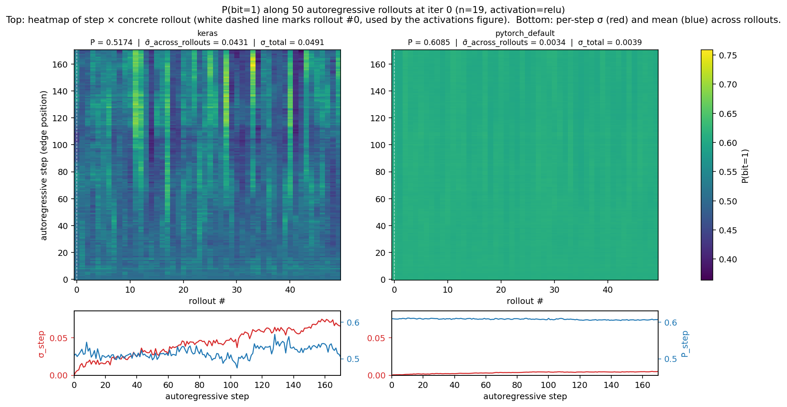
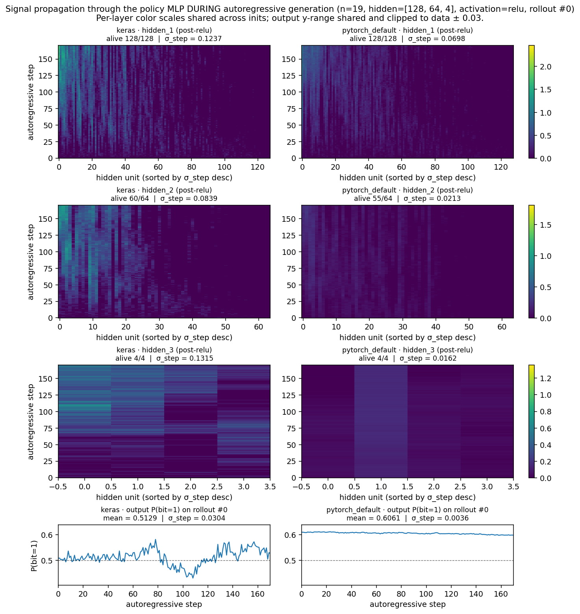

# graph-ce

A modern PyTorch reimplementation of Adam Zsolt Wagner's cross-entropy method
(CEM) for finding counterexamples to **Conjecture 2.1** from
[*Constructions in combinatorics via neural networks*](https://arxiv.org/abs/2104.14516):

> For every connected graph G on n vertices,
> &nbsp;&nbsp;λ₁(G) + μ(G) ≥ √(n − 1) + 1
> &nbsp;&nbsp;where λ₁ is the largest adjacency eigenvalue and μ is the size of a maximum matching.

The conjecture is false at n = 19. This codebase rediscovers a counterexample
in **about 10 minutes** of wall time on a 128-core CPU server (no GPU
required), with 16 parallel Cross-Entropy Method islands.

## Result

```
status:  success
winner:  island 9, iter 1411, score = +0.0804
λ₁     = 3.1623  (= √10)
μ      = 2
λ₁ + μ = 5.1623 < √18 + 1 ≈ 5.2426
duration: 10.7 min on 128 CPU cores (no GPU)
```

The graph is a *double broom*: two stars (9 leaves each) joined through a
shared "bridge" vertex of degree 2. Adam Wagner's paper highlights the same
structural family.


A second, slightly tighter counterexample falls out of the no-migration
configuration — an 8/10 split with score +0.0155:


Both are reproducible from saved adjacency matrices via
`graph-ce-plot-winner runs/n19_success` (and similarly for the
`runs/n19_success_with_migration` artifact tree).

## Trajectories across configurations


Here, we experimented with:

* batch size `b`
* `migration` on/off - whether top-scoring examples were shared between parallel cross-entropy runs ("islands")
* layer initialization: for the MLP we used it's either Xavier (used by default in Keras and the original Wagner's implementation) or Kaiming (used by default in Pytorch)

Each color shows 3 best per-island trajectories. The two configs that cross the dotted victory line at score = 0 (purple and brown) are the two successful runs.

It's interesting that layer intialization influences the result so much; we tried to investigate it a bit.

## Why the wrong initialization breaks the training process?

First of all, let's visualize the results, showing the best graph from each island at the final iteration of CEM. We also show the timing when each
island's best graph last changed. The probe lives at `scripts/explore_plateau_topology.py`.

### With migration: all 16 islands collapse to the same tree


In `n19_main_plateau_v3` (PyTorch init, migration on, b=512), all 16 islands converge to **the same tree**, up to graph isomorphism, and showed no further improvement. That's the price of best-graph migration: it speeds up convergence to a local optimum.

### Without migration: every island finds its own local optimum


In `n19_main_plateau_v4` (PyTorch init, no migration, b=512), every island discovers a unique local optimum. The graphs fail to evolve massive hubs needed for the actual counterexample.


`n19_main_plateau_v5` (PyTorch init, no migration, b=32) shows the same story: 16 unique non-isomorphic graphs. Some islands froze as early as
iter 1255 of 10500 and produced no further improvement across the remaining 88% of the run.

You can reproduce the analysis with:

```bash
.venv/bin/python scripts/explore_plateau_topology.py \
    runs/n19_main_plateau_v3 runs/n19_main_plateau_v4 runs/n19_main_plateau_v5 \
    --mode all-classes \
    --output plots/plateau_trees.png
```

## What "good init" means — and why it matters so much

In our task, the data is quite specific. Namely, we generate a graph step by step, on `i`-th step feeding into the network a vector of length 342

```
[
  edge(1)/no edge(0) at positions 0...i-1 |
  zeros at positions i...171 |
  one-hot encoding of i
]
```

to predict edge/no edge at position `i`.

As you see, it's quite unlike images or dense text embeddings.

Let's look closer at the two initialization types.

**PyTorch's `nn.Linear` default**:

- **Weights** come from the **Kaiming** initialization `nn.init.kaiming_uniform_(weight, a=sqrt(5))`.
  Plugging `a=sqrt(5)` into the Kaiming formula yields gain = `sqrt(2/(1+5)) =
  1/sqrt(3)`, so the bound simplifies to `1/sqrt(d_in)`. Weights are drawn from
  `U(−1/sqrt(d_in), +1/sqrt(d_in))`. For the four-layer MLP we used that's `±0.054`
  (layer 1, 342→128), `±0.088` (layer 2, 128→64), `±0.125` (layer 3,
  64→4), `±0.500` (layer 4, 4→1).
- **Biases** are *also* drawn from `U(−1/sqrt(d_in), +1/sqrt(d_in))` — same
  bounds as the weights, **not zero**.

This seems to be a [well-known historical artifact in PyTorch](https://github.com/pytorch/pytorch/issues/15314): the function name references Kaiming/He init (He et al., 2015 — derived for ReLU with `a=0` so that activation variance is preserved through deep stacks), but the `a=sqrt(5)` parameter reduces the formula to LeCun's
1998 bounds. LeCun's scheme is calibrated for linear or tanh networks with dense zero-mean unit-variance inputs.  None of those conditions actually hold for our setup: we have ReLU activations and 0-1 inputs.

**Keras's `Dense` default** (what Adam Wagner relies on):

- **Weights** are Glorot (Xavier) uniform — drawn from `U(−a, +a)`  with `a = sqrt(6 / (fan_in + fan_out))`. For our four-layer MLP that's `±0.113` (layer 1), `±0.177` (layer 2), `±0.297` (layer 3), `±1.095` (layer 4).
- **Biases** are zero.

Glorot & Bengio (2010) derived this scheme to simultaneously preserve forward-activation variance and backward-gradient variance across layers. The derivation assumes (i) zero-mean unit-variance inputs and (ii) activations approximately linear around zero with unit derivative
(tanh, sigmoid). It is therefore not theoretically optimal either for our inputs and ReLU, but it eventually works thanks to larger weight values.

### Watching it generate: per-step edge probabilities and their variance

For CEM to succeed, elite states in different rollouts should be diverse enough. But with Pytorch initialization, diversity only evolves very slowly. 

For each init we ran 50 autoregressive rollouts from one iter-0 model
(shared sampling RNG across inits, so trajectories diverge *only* when
the policy itself responds differently to state). Heatmap rows are
generation steps, columns are concrete rollouts, color is the policy's
`P(bit=1)` at that step in that rollout. The bottom strip plots
per-step σ-across-rollouts (red) and mean (blue), shared y-axis across
columns.



As you see, Keras-style initialization leads to much more diverse generations (~14x gap in variance), producing more structured graphs, while Pytorch gives a much more uniform image. And the counterexample graph we strive to get is very structured.

### Where the variance vanishes: layer by layer along one rollout

To localize the collapse, we capture the post-activation of every
hidden layer along a single representative rollout — the leftmost
column of the heatmap above, marked with a white dashed line. Each
heatmap is rows = generation step, columns = hidden units sorted
left-to-right by their across-step σ (so "alive" units cluster on the
left and the dead/saturated slab is on the right). Color scales are
shared across inits within each row.



| layer            | keras (alive/total, σ_step)  | pytorch_default              |
|------------------|------------------------------|------------------------------|
| hidden_1 (128)   | 128/128, σ = **0.124**       | 128/128, σ = **0.070**       |
| hidden_2 (64)    | 60/64, σ = **0.084**     | 55/64, σ = **0.021**     |
| hidden_3 (4)     | 4/4,    σ = **0.132**        | 4/4,    σ = **0.016**        |
| output P(bit=1)  | σ_step ≈ **0.13**            | σ_step ≈ **0.004**           |

(`σ_step` here = std over 171 steps of *this* rollout, averaged over
units. Different statistic from σ̄_step above, which was std over
rollouts averaged over steps — but they tell the same story.)

Some hidden_2 units die under both inits, but what seems to be important here is the difference in variances.

**Note**: We might suspect that ReLU might partially be to blame in this situation, but switching to `LeakyReLU` doesn't save Pytorch initialization.

So the takeaway here is, I would say: if you try to use initialization, which is theoretically good for one input distribution, for a totally different kind of input distribution, you might get bad results.

## Other gotchas worth knowing

1. **BLAS thread oversubscription**. `OMP_NUM_THREADS=1` and friends *must*
   be set before any module imports numpy/torch — env vars set after import
   have no effect. We pin them in `graph_ce/__init__.py` so they fire on
   any first import of the package. Without this pin, 16 islands × 8 score
   workers × 128 BLAS threads each thrashed the 128-core box; per-iter time
   was ~155s instead of ~0.3s. Also `torch.set_num_threads(1)` for belt
   and suspenders.

2. **mp.Event in signal handlers deadlocks**. `multiprocessing.Event.set()`
   acquires an internal `Lock` that the main thread already holds inside
   `mp.Event.wait()`. If a SIGTERM handler calls `.set()`, the handler
   deadlocks; the process can no longer be stopped except by SIGKILL. Our
   handler flips a plain Python `bool`; the main thread polls that flag in
   short slices and calls `.set()` safely from its own context.

3. **Elite-selection ties bloat the pool**. A plain
   `scores >= np.percentile(scores, 93)` admits every session tied at the
   threshold. Once CEM converges, many sessions land *exactly* at the
   threshold, the elite pool balloons (we saw 2168 instead of ~70), and
   training over-reinforces the current local optimum. Wagner's reference
   uses a counter-based tie cap; we ported that logic to
   `graph_ce.cem.select_by_percentile_with_tiebreak`. Without it, migration
   is actively destructive.

4. **Batch size matters but only after the init is right**. Keras'
   `model.fit()` default is `batch_size=32`; we initially used 512. With
   the init bug, switching to 32 didn't help; both still plateaued. With
   the init fix, b=32 reliably finds the counterexample in a few thousand
   iters and b=512 grinds for 6× the compute without converging. Our
   default is now 32.

5. **NetworkX's matching is slow on small graphs**. `nx.max_weight_matching`
   takes ~3.6 ms per 19-vertex graph in pure-Python overhead; the
   actual blossom algorithm should take microseconds. We rewrote Edmonds'
   blossom directly (`graph_ce.matching.max_cardinality_matching`) for a
   ~24× speedup. The replacement is randomized-stress-tested against
   NetworkX on hundreds of graphs at production size.

## Quick start

```bash
python3 -m venv .venv
.venv/bin/pip install -e ".[dev]"

# Launch the n=19 search detached from your shell. Survives SSH disconnect,
# Claude Code session timeouts, etc.
scripts/launch_detached.sh n19_main

# Watch progress (re-runnable, defaults to runs/n19_main/).
.venv/bin/graph-ce-status

# Stop cleanly (the coordinator catches SIGTERM and tears down all 16
# island processes gracefully):
kill "$(cat runs/n19_main.pid)"
```

When a counterexample is found the coordinator writes
`runs/<run_name>/winner_certificate.txt` and exits.

### Reproducing the published-counterexample search

The default config is exactly the configuration that won. Running
`scripts/launch_detached.sh n19_main` and waiting should produce a winner
within roughly 10–30 minutes (CEM is noisy, single-run variance is high).
With migration **off** and everything else default, expect ~20 minutes.

To reproduce the *failure modes* described in the sections above (e.g.
for a blog post or to teach CEM gotchas), override the config:

```bash
# Reproduce the PyTorch-default init plateau:
scripts/launch_detached.sh n19_bad_init \
    --override model.init=pytorch_default
```

## Configuration

Every tunable lives in `configs/default.yaml`. Nothing in the code
hardcodes any of them. The shipped defaults are what won on a 128-core
box; the only knobs you'll typically touch are `parallelism.*` (CPU
budget) and `seed.master_seed` (reproducibility). Everything else is
faithful to Adam Wagner's setup and should stay put unless you're doing
an ablation.

### Matching parallelism to your CPU count

The total number of CPU-active processes during scoring is:

&nbsp;&nbsp;&nbsp;&nbsp;`parallelism.n_islands × parallelism.cores_per_island`

Set this product to your physical core count. The defaults are tuned
for **128 cores** (16 × 8). If your machine differs, here are sane
re-balancings:

| Cores | `n_islands` | `cores_per_island` | Notes |
|------:|------------:|-------------------:|-------|
|     8 |           4 |                  2 | Tight; expect 30–60 min per attempt. |
|    16 |           8 |                  2 | A laptop-class run. |
|    32 |           8 |                  4 | A modest workstation. |
|    64 |          16 |                  4 | Same seed diversity as production, half the throughput. |
|   128 |          16 |                  8 | **Default — what found the counterexample in 10 min.** |
|   256 |          32 |                  8 | More seeds in parallel, ~same per-island speed. |

Two principles when sizing:

1. **More islands = more independent seeds = higher chance one of them gets
   lucky.** Adam Wagner reports ~30% per-seed success; with 16 islands
   that compounds to ~99.5% (with migration on, the practical hit rate is
   higher still — the lucky seed shares its discovery with the others).
   Don't drop below ~4 islands unless you really have to.

2. **More cores per island ≠ much faster per iteration.** Per-iter time
   is dominated by the autoregressive sampling step (171 forward passes
   through a tiny MLP, single-threaded by design — see the BLAS-pinning
   note above), not by score evaluation. So cores beyond ~4 per island
   give diminishing returns. Prefer adding islands to adding cores.

Plus one hard rule: **never let `n_islands × cores_per_island` exceed your
physical core count**, even by a little. Once total processes go over
core count the BLAS-thread-pinning trick we rely on (everyone gets
exactly one core) breaks, and per-iter time can blow up by ~500× into
context-thrash hell. We've seen this happen.

### Other knobs (in roughly decreasing order of "actually useful to tune")

| Knob | Default | What it does |
|------|---------|--------------|
| `seed.master_seed` | `null` | `null` means time-based, logged. Set an integer to reproduce a specific run exactly. Each island gets `master_seed + island_id`. |
| `migration.enabled` | `true` | Off by default in the no-mig ablation; on for production. With the tie-cap in place, migration is roughly a 2× speedup. |
| `migration.interval_iters` | `50` | Iterations between migration syncs. Lower = more sharing, less seed diversity. Higher = closer to no-migration. |
| `migration.top_k` | `50` | Number of elites broadcast to every island at each sync. |
| `stopping.wall_clock_seconds` | `43200` | Hard 12 h budget. Drop to e.g. `1800` for a "try 30 min and bail" run. |
| `cem.max_iters` | `100000` | Per-island iteration cap. Defaults are effectively unbounded; wall clock is what stops you. |
| `logging.log_interval_iters` | `10` | How often each island writes a human-readable progress line to its log. |
| `logging.metrics_interval_iters` | `1` | How often the per-iter JSONL row is written. Includes the iteration's best graph; leave at 1 unless disk space is a concern. |
| `problem.n` | `19` | Graph size. The n=19 counterexample is the famous one; smaller `n` (e.g. 5–10) is useful for smoke testing. |

### Things you should not touch unless you know why

- `model.hidden_sizes`, `model.learning_rate`, `model.optimizer` — Adam
  Wagner's exact values. Deviating without an ablation is almost
  certainly worse.
- `cem.n_sessions`, `cem.elite_percentile`, `cem.super_elite_percentile`,
  `cem.train_batch_size`, `cem.train_epochs_per_iter` — same.
- `parallelism.start_method` — leave at `spawn`. `fork` shares torch
  state across processes and produces deeply weird bugs.
- `model.init` — `keras` is the right choice and the only setting under
  which we've ever found a counterexample. `pytorch_default` is kept as
  an ablation toggle to reproduce the plateau failure mode; see the
  "What 'good init' means" section.

## Architecture

```
coordinator (1 process)
├── spawns 16 island processes
├── listener thread: PROGRESS | MIGRATE_OUT | SUCCESS | FAILED | DONE
├── liveness thread: detects islands that die without sending a terminal
│                    status (with a grace period for in-flight messages)
├── main loop: polls signal flag + stop_event in 1 s slices
└── on stop_event: drain queues, join islands, write summary.json

island_i (1 process, ×16)
├── own torch MLP, optimizer, RNG (seeded master_seed + i)
├── own multiprocessing.Pool(8) for score eval
├── CEM loop: sample(1000) → score → percentile-tie-cap elite filter →
│             train(1 epoch, BCE, b=32) → maybe migrate
└── on counterexample: notify coordinator, exit
```

128 cores total = 16 island main processes + 16 × 8 score workers, all
pinned to 1 BLAS thread per process.

## What's in the box

```
configs/default.yaml      every tunable — graph size, MLP shape, CEM percentiles,
                          parallelism, migration cadence, logging, RNG seed.
                          Nothing in code hardcodes these.

src/graph_ce/
  config.py               pydantic loader + override mechanism
  model.py                PolicyMLP (342 → 128 → 64 → 4 → 1, sigmoid)
  score.py                sqrt(n-1)+1 − λ₁ − μ (or -INF if disconnected)
  matching.py             pure-Python Edmonds blossom (~24× faster than NetworkX
                          on n=19, validated by stress test in tests/)
  sampler.py              vectorized autoregressive bit-by-bit generation
  cem.py                  one CEM iteration (sample → score → elite → train),
                          with Wagner's percentile tie-cap
  island.py               long-running worker: own MLP, own RNG, own score Pool
  coordinator.py          master process: 16 islands, migration broker,
                          liveness monitor, signal-safe graceful shutdown
  verify.py               independently re-scores winners and writes the
                          certificate
  status.py               graph-ce-status: at-a-glance run health
  plot_trajectories.py    graph-ce-plot: trajectory comparison figure
  run.py                  graph-ce CLI entry

scripts/
  launch_detached.sh      setsid+nohup launcher — runs survive harness/session
                          cleanup; writes runs/<name>.pid for `kill` later

tests/                    65 unit tests (matching ↔ NetworkX oracle, sampling
                          determinism, elite tie-cap, init schemes, smoke E2E)
```

## Adapting the reward for a different graph conjecture

The CEM machinery — sampler, model, training, parallelism, migration,
logging, graceful shutdown, the whole island/coordinator setup — is
**generic over the score function**. To target a different conjecture
about simple undirected graphs on n vertices, you'll only need to edit
two-and-a-half files (typically 30–60 minutes of work):

### What's reusable as-is

- Bit-string → symmetric adjacency matrix (`score.build_adjacency`).
- Connectedness check via BFS (`score.is_connected`).
- Eigenvalue computation (`numpy.linalg.eigvalsh`).
- Maximum-cardinality matching via custom Edmonds blossom
  (`matching.max_cardinality_matching`, ~24× faster than NetworkX).
- The full CEM loop, all parallelism, all logging.

### What you'd change

1. **`src/graph_ce/score.py`**: rewrite `score_graph` to compute and return
   your conjecture's reward. The skeleton is:

   ```python
   def score_graph(bits: np.ndarray, n: int) -> ScoreResult:
       A = build_adjacency(bits, n)
       if not is_connected(A):                  # drop this line if your
           return ScoreResult(                  # conjecture allows
               score=DISCONNECTED_PENALTY,      # disconnected graphs
               ...,
           )
       # Compute whichever invariants your conjecture needs.
       # Examples already wired up: eigvalsh(A), matching_number(A).
       # Other invariants you might add: chromatic number, independence
       # number, diameter, girth, vertex cover, etc.
       my_score = your_threshold(n) - your_invariants(A)
       return ScoreResult(score=my_score, connected=True, ...)
   ```

   A score `> 0` is interpreted everywhere as "counterexample found", so
   write your reward so that you want to *maximize* it and victory means
   "strictly positive".

2. **`src/graph_ce/verify.py`**: update `verify_and_save_winner`'s
   certificate text to print whichever invariants your `score_graph`
   computes (so the human-readable proof shows the right numbers).

3. **`src/graph_ce/config.py`**: if your conjecture has a closed-form RHS
   in terms of `n`, replace the `ProblemConfig.conjecture_threshold`
   property; if not, just delete the property.

That's it. The MLP shape, batch size, percentiles, optimizer, migration,
all stay the same. Adam Wagner's paper applies CEM the same way to a
dozen conjectures with different score functions — only the score
function ever changes.

### What's *not* easy to swap

- **Directed graphs** (the bit-encoding length doubles from `n(n−1)/2` to
  `n(n−1)`; sampling and score input change accordingly).
- **Weighted edges** (the alphabet stops being binary; Wagner has a short
  note on this — you'd switch the model's output to softmax over k
  categories and use cross-entropy loss).
- **Variable `n` within one run** (we treat `n` as a single config value).
- **Multi-graph encodings, hypergraphs, or anything beyond simple graphs**
  (the encoding layer would need substantial extension).

If you adapt this for another conjecture from Adam Wagner's paper, you're
encouraged to keep your fork local — this repository is intentionally
scoped to Conjecture 2.1.

## Tests

```bash
.venv/bin/pytest
```

65 tests in ~2.5 seconds. Includes a randomized stress test that compares
our blossom matching against NetworkX on 330 random n=19 graphs at three
densities, and a tiny end-to-end smoke test that runs the full CEM step
without subprocesses.

## Reference and citation

The algorithm, the conjecture, the score function, and the original code
this repo is reproducing are all due to **Adam Zsolt Wagner**:

> Wagner, A. Z. *Constructions in combinatorics via neural networks*.
> arXiv preprint arXiv:2104.14516, 2021.

Original repository (TensorFlow 1.14 + Keras 2.3.1): https://github.com/zawagner22/cross-entropy-for-combinatorics

```bibtex
@article{wagner2021constructions,
  title   = {Constructions in combinatorics via neural networks},
  author  = {Wagner, Adam Zsolt},
  journal = {arXiv preprint arXiv:2104.14516},
  year    = {2021}
}
```

If you use this codebase, please cite Wagner's paper. This repository is
an engineering port — every interesting idea is his.
